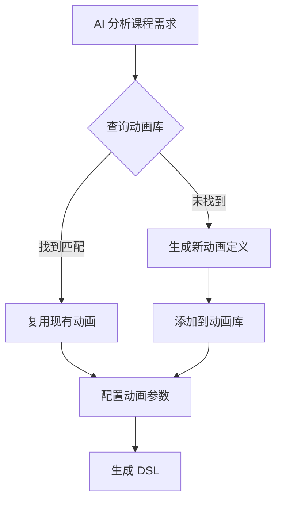

# VVCE Animation Library

动画资源库 - 可复用的交互式科学实验动画

## 概述

动画库是 VVCE 的核心资源系统，提供：

- 🎨 预设动画库（物理、化学、地理等）
- 🔄 动画复用机制
- 🎮 交互控制（播放、暂停、缩放、3D）
- 📦 可扩展架构

## 目录结构

```
packages/vvce-animations/
├── src/
│   ├── physics/              # 物理实验动画
│   │   ├── pisa-tower.ts    # 比萨斜塔自由落体
│   │   ├── pendulum.ts      # 单摆实验
│   │   ├── collision.ts     # 碰撞实验
│   │   └── inclined-plane.ts # 斜面实验
│   ├── geography/           # 地理天文动画
│   │   ├── earth-system.ts  # 地球公转自转
│   │   ├── solar-system.ts  # 太阳系
│   │   ├── water-cycle.ts   # 水循环
│   │   └── plate-tectonics.ts # 板块运动
│   ├── chemistry/           # 化学实验动画
│   │   ├── reaction.ts      # 化学反应
│   │   ├── electrolysis.ts  # 电解
│   │   └── combustion.ts    # 燃烧
│   ├── biology/             # 生物动画
│   │   ├── cell-division.ts # 细胞分裂
│   │   ├── photosynthesis.ts # 光合作用
│   │   └── dna-replication.ts # DNA复制
│   ├── math/                # 数学可视化
│   │   ├── function-graph.ts # 函数图像
│   │   ├── geometry.ts      # 几何变换
│   │   └── probability.ts   # 概率演示
│   ├── core/                # 核心系统
│   │   ├── AnimationBase.ts # 动画基类
│   │   ├── AnimationController.ts # 控制器
│   │   ├── InteractionHandler.ts  # 交互处理
│   │   └── registry.ts      # 注册表
│   ├── types.ts             # 类型定义
│   └── index.ts             # 导出
├── package.json
├── tsconfig.json
└── README.md
```

## 动画定义标准

### 动画元数据

```typescript
interface AnimationMetadata {
  id: string; // 唯一ID，如 "physics.pisa-tower"
  category: 'physics' | 'geography' | 'chemistry' | 'biology' | 'math';
  name: string; // 显示名称
  description: string; // 描述
  author?: string; // 作者
  version: string; // 版本
  tags: string[]; // 标签，便于搜索
  thumbnail?: string; // 缩略图
  dependencies?: string[]; // 依赖的其他动画
}
```

### 动画定义

```typescript
interface AnimationDefinition {
  metadata: AnimationMetadata;

  // 渲染方法
  render: (container: HTMLElement, props: any) => void;

  // 控制方法
  play?: () => void;
  pause?: () => void;
  reset?: () => void;
  seek?: (progress: number) => void; // 0-1

  // 交互方法
  zoom?: (scale: number) => void;
  rotate?: (x: number, y: number, z: number) => void;

  // 生命周期
  onMount?: () => void;
  onUnmount?: () => void;

  // 状态
  getState?: () => any;
  setState?: (state: any) => void;
}
```

## DSL 使用方式

### 方式 1: 引用预设动画

```json
{
  "id": "pisa-experiment",
  "type": "Animation",
  "props": {
    "animationId": "physics.pisa-tower",
    "autoplay": false,
    "controls": true,
    "interactive": true,
    "config": {
      "heavyBallMass": 10,
      "lightBallMass": 1,
      "height": 56,
      "gravity": 9.8
    }
  }
}
```

### 方式 2: 内联自定义动画

```json
{
  "id": "custom-anim",
  "type": "Animation",
  "props": {
    "type": "custom",
    "renderer": "css",
    "definition": {
      "html": "<div class='custom'>...</div>",
      "css": ".custom { ... }",
      "keyframes": { ... }
    }
  }
}
```

### 方式 3: 3D 动画（Three.js）

```json
{
  "id": "3d-molecule",
  "type": "Animation",
  "props": {
    "animationId": "chemistry.molecule-3d",
    "renderer": "threejs",
    "interactive": true,
    "controls": {
      "orbit": true,
      "zoom": true,
      "pan": true
    }
  }
}
```

## 动画控制 Actions

### 播放控制

```json
{
  "action": "animationPlay",
  "target": "pisa-experiment"
}

{
  "action": "animationPause",
  "target": "pisa-experiment"
}

{
  "action": "animationReset",
  "target": "pisa-experiment"
}

{
  "action": "animationSeek",
  "target": "pisa-experiment",
  "progress": 0.5  // 跳到50%处
}
```

### 交互控制

```json
{
  "action": "animationZoom",
  "target": "earth-system",
  "scale": 1.5
}

{
  "action": "animationRotate",
  "target": "molecule-3d",
  "x": 45,
  "y": 90,
  "z": 0
}
```

## 交互式控制面板

当 `controls: true` 时，自动显示控制面板：

```
┌─────────────────────────────────────┐
│  ⏮️ ⏯️ ⏸️ ⏹️ ⏭️   [======>----] 60%  │
│  🔍- 🔍+  🔄  📷  ⚙️                │
└─────────────────────────────────────┘
```

功能：

- ⏮️ 重置
- ⏯️ 播放/暂停
- ⏹️ 停止
- ⏭️ 快进
- 🔍 缩放
- 🔄 重置视角
- 📷 截图
- ⚙️ 设置

## 动画库扩展

### 贡献新动画

1. 在对应分类下创建文件
2. 实现 AnimationDefinition 接口
3. 在 registry.ts 中注册
4. 添加测试和文档

示例：

```typescript
// src/physics/pisa-tower.ts
import { AnimationDefinition } from '../types';

export const pisaTowerAnimation: AnimationDefinition = {
  metadata: {
    id: 'physics.pisa-tower',
    category: 'physics',
    name: '比萨斜塔实验',
    description: '伽利略的自由落体实验',
    version: '1.0.0',
    tags: ['自由落体', '重力', '经典力学'],
  },

  render(container, props) {
    // 渲染逻辑
  },

  play() {
    // 播放逻辑
  },

  pause() {
    // 暂停逻辑
  },

  // ...其他方法
};
```

## 动画复用场景

### 场景 1: 多个课程使用同一动画

课程A - 初中物理：

```json
{
  "animationId": "physics.pisa-tower",
  "config": { "height": 40, "showLabels": true }
}
```

课程B - 高中物理：

```json
{
  "animationId": "physics.pisa-tower",
  "config": { "height": 80, "showVectors": true, "calcFormula": true }
}
```

### 场景 2: 组合动画

```json
{
  "type": "AnimationComposite",
  "animations": [
    { "animationId": "geography.earth-system" },
    { "animationId": "geography.moon-orbit" }
  ]
}
```

## AI 生成课程时的使用流程



### 示例：AI 生成流程

**输入：** "创建一个关于单摆实验的物理课件"

**AI 决策：**

1. 检查动画库：`physics.pendulum` 存在
2. 复用动画，配置参数：
   ```json
   {
     "animationId": "physics.pendulum",
     "config": {
       "length": 1.5,
       "mass": 2,
       "angle": 30,
       "showEnergy": true
     }
   }
   ```

**输入：** "创建一个关于蒸馏实验的化学课件"

**AI 决策：**

1. 检查动画库：`chemistry.distillation` 不存在
2. 生成新动画定义
3. 保存到库中以备将来复用

## 技术实现

### CSS 动画

适用于：2D 简单动画

```typescript
interface CSSAnimation {
  renderer: 'css';
  html: string;
  css: string;
  keyframes: Record<string, Keyframe[]>;
}
```

### Canvas 动画

适用于：2D 复杂交互

```typescript
interface CanvasAnimation {
  renderer: 'canvas';
  draw: (ctx: CanvasRenderingContext2D, time: number) => void;
  update: (deltaTime: number) => void;
}
```

### Three.js 3D 动画

适用于：3D 可视化

```typescript
interface ThreeJSAnimation {
  renderer: 'threejs';
  scene: THREE.Scene;
  camera: THREE.Camera;
  objects: THREE.Object3D[];
  update: (deltaTime: number) => void;
}
```

### WebGL 动画

适用于：高性能 3D

```typescript
interface WebGLAnimation {
  renderer: 'webgl';
  vertexShader: string;
  fragmentShader: string;
  uniforms: any;
}
```

## 性能优化

1. **懒加载** - 按需加载动画资源
2. **缓存** - 已加载的动画保持在内存
3. **预加载** - 提前加载即将使用的动画
4. **降级** - 低性能设备使用简化版

## 数据统计

动画库可追踪：

- 每个动画的使用次数
- 受欢迎程度
- 性能指标
- 用户反馈

用于：

- 优化常用动画
- 淘汰冷门动画
- 指导新动画开发

## 未来扩展

- [ ] VR/AR 支持
- [ ] 物理引擎集成（Matter.js, Cannon.js）
- [ ] 粒子系统
- [ ] 流体模拟
- [ ] 音效同步
- [ ] 多人协作（同步观看）

## 示例：完整的物理课件

```json
{
  "scenes": [
    {
      "id": "intro",
      "nodes": [
        {
          "type": "Dialog",
          "props": { "text": "今天我们学习自由落体" }
        },
        {
          "type": "Animation",
          "props": {
            "animationId": "physics.pisa-tower",
            "controls": true,
            "interactive": true
          }
        },
        {
          "type": "AnimationControls",
          "props": {
            "target": "pisa-tower",
            "buttons": ["play", "pause", "reset", "slow-mo"]
          }
        }
      ]
    }
  ]
}
```

---

**这个动画库系统是 VVCE 的核心竞争力！** 🚀
